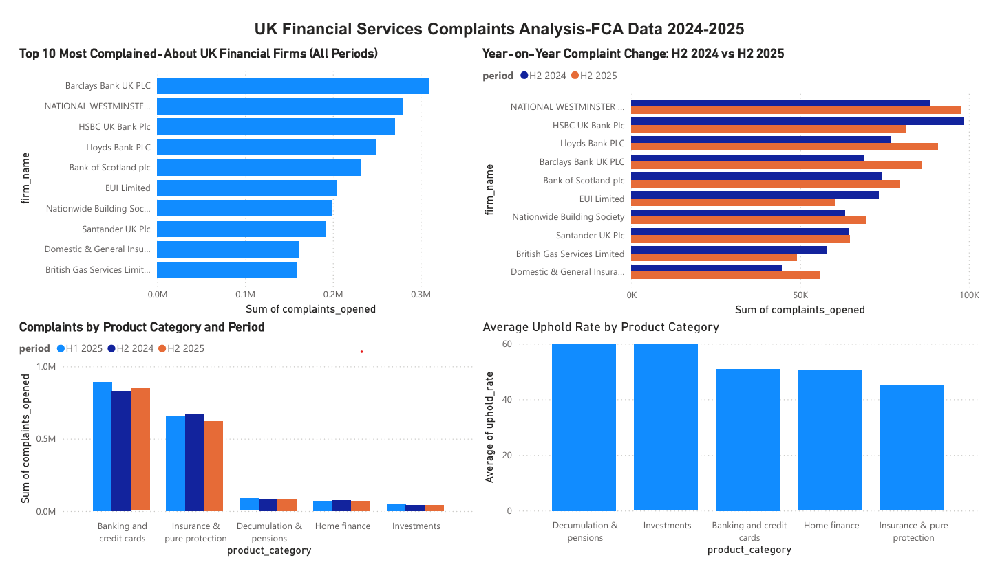

# UK Financial Services Complaints Analysis

A SQL and Power BI analysis of UK financial firm complaints data published
by the Financial Conduct Authority (FCA), covering three reporting periods:
H2 2024, H1 2025, and H2 2025.

---

## Overview

This project investigates complaint patterns across UK financial services
firms to answer four core questions:

- Which firms receive the most complaints, and are things getting better
  or worse over time?
- Which firms admit fault most often (highest uphold rates)?
- Which financial products drive the most complaints?
- Are firms keeping up with resolving complaints, or falling behind?

---

## Data Source

**Financial Conduct Authority (FCA) — Firm-level complaints data**
Published at: https://www.fca.org.uk/data/complaints-data

The FCA requires all UK financial firms receiving 500+ complaints in a
6-month period to report those complaints publicly. This dataset covers
approximately 200+ firms across five product categories per period:

- Banking and credit cards
- Insurance & pure protection
- Decumulation & pensions
- Home finance
- Investments

**Raw data is not included in this repository** - download directly from
the FCA link above (firm-specific data, H2 2024 / H1 2025 / H2 2025).

---

## Data Pipeline

The raw FCA workbooks store data in wide format (one column per product
category) across multiple sheets. A Python/pandas cleaning step reshapes
this into long format (one row per firm / product / period) for SQL
analysis.

```
FCA Excel workbooks (3 periods)
        ↓
Python cleaning (data_cleaning/fca_data_cleaning.ipynb)
        ↓
3 clean CSV files (data/)
        ↓
PostgreSQL database (fca_complaints)
        ↓
SQL analysis (queries/fca_complaints_queries.sql)
        ↓
Power BI dashboard (outputs/)
```

---

## SQL Analysis

Eight queries were written in PostgreSQL, demonstrating a range of SQL
techniques:

| Query | Question | Skills |
|-------|----------|--------|
| 1 | Top 10 most complained-about firms (H2 2025) | SUM, GROUP BY, ORDER BY, LIMIT |
| 2 | Firms with uphold rates above 80% | AVG, ROUND, HAVING |
| 3 | Year-on-year complaint change (H2 2024 vs H2 2025) | CTEs, JOIN, % change |
| 4 | Complaints and uphold rates by product category | Multi-key LEFT JOIN |
| 5 | Firms consistently in top 20 across all periods | RANK() window function, PARTITION BY |
| 6 | Complaint concentration - what % comes from top firms? | Cumulative SUM() OVER() window |
| 7 | Parent group analysis vs market average | Scalar subquery, CASE logic |
| 8 | Resolution backlog - opened vs closed | Two CTEs joined, derived backlog |

Full annotated SQL file: `queries/fca_complaints_queries.sql`

---

## Key Findings

### 1. A small number of firms dominate complaint volumes
The top 12 firms account for over 50% of all UK financial complaints in
H2 2025. The top 20 firms account for 64.4%. Barclays Bank UK PLC leads
with an average of 103,006 complaints per period across all three periods.

### 2. Complaint volumes are rising at some firms
Munich Re Digital Partners saw complaints increase by 288.8% from H2 2024
to H2 2025. Trading 212 UK Limited saw a 159% increase. NatWest, by
contrast, showed a slight decrease - one of the few large firms improving.

### 3. Pensions and investments have the highest uphold rates
Decumulation & pensions and Investments have average uphold rates of
~58-60%, meaning firms admit fault on more than half of complaints in
these categories. Insurance & pure protection has the lowest uphold rate
(~44%), meaning insurers reject more than half of complaints against them.

### 4. Banking dominates by volume but not by uphold rate
Banking and credit cards generates ~850,000+ complaints per period, far
more than any other product. But its uphold rate (~50-52%) is middle of
the range, suggesting volume reflects market size more than poor
performance.

### 5. Some firms are falling behind on resolution
Creation Consumer Finance opened 10,537 complaints in H2 2025 but closed
only 3,740 - a backlog ratio of just 35%. NatWest and Lloyds carry large
absolute backlogs (~5,000-6,000) but resolve ~94% of what they open,
suggesting their backlog reflects volume rather than inefficiency.

### 6. Parent group analysis changes the rankings
At individual brand level, NatWest tops the complaint league table in H2
2025. At corporate group level, Lloyds Banking Group leads with 196,465
complaints, nearly double NatWest Group's 120,582 - because it owns
multiple brands (Lloyds Bank, Bank of Scotland, Halifax) whose complaints
combine.

---

## Power BI Dashboard

A four-chart interactive dashboard was built in Power BI Desktop,
connecting directly to the PostgreSQL database:

- Top 10 most complained-about firms (all periods)
- Complaints by product category and period
- Year-on-year complaint change: H2 2024 vs H2 2025
- Average uphold rate by product category
  
export: `outputs/fca_complaints_dashboard.pdf`


---

## Repository Structure

```
UK-FCA-Complaints-Analysis/
├── queries/
│   └── fca_complaints_queries.sql     # CREATE TABLE + 8 SQL queries
├── data_cleaning/
│   └── fca_data_cleaning.ipynb        # Python cleaning notebook
├── data/
│   ├── complaints_opened.csv          # 1,265 rows
│   ├── complaints_upheld.csv          # 1,110 rows
│   └── complaints_closed.csv          # 1,257 rows
└── outputs/
    └── fca_complaints_dashboard.pdf   # Power BI dashboard export
```

---

## Limitations

**Data covers only large firms.** The FCA only requires firms with 500+
complaints to report publicly. Smaller firms are excluded, meaning the
dataset reflects the large-firm segment of UK financial services.

**Uphold rates are firm-reported.** Firms self-report uphold rates to the
FCA. While the FCA audits these figures, there is a degree of subjectivity
in how firms classify complaints as upheld or not upheld.

**Three periods only.** With H2 2024, H1 2025, and H2 2025, longer-term
trend analysis is limited. Year-on-year comparisons (H2 2024 vs H2 2025)
are reliable; H1 comparisons are not available beyond one period.

---

## Tools

- **PostgreSQL 16** + **pgAdmin 4** - database and SQL query environment
- **Python / pandas** (Kaggle) - data cleaning and reshaping
- **Power BI Desktop** - interactive dashboard

---

*Built by Sydney Ndabai*
